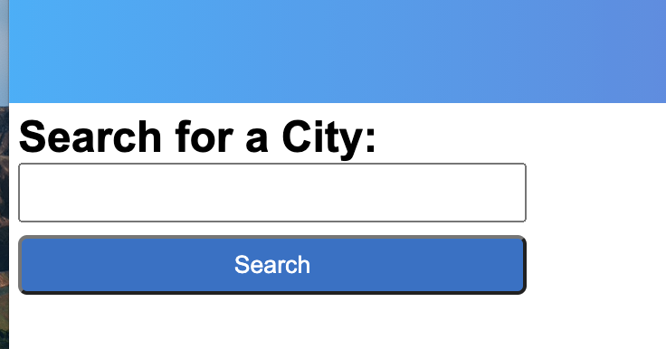
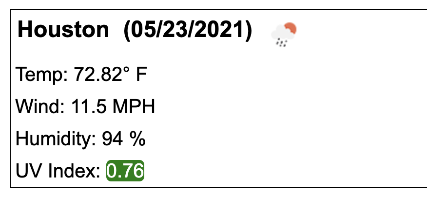

# bluesky

## Description

Blue Sky is a simple weather dashboard that displays the current weather conditions as well as the five day forecast. In order to better plan your week Blue Sky was created with simplicity in mind to display all the weather information you would need. 

Go on and check out :sunny: :rainbow::cloud: [Blue Sky](https://disantoz.github.io/bluesky/)! 

## Usage

When the user loads Blue Sky, they are presented with an input box that asks the user to enter a city name:

Upon entering the name of the city, the user is presented with the current weather forecast that displays the temperature, wind speed, humidity, and the UV Index: 

The planner dynamically changes as the day progress. Any time in the past will display a grey color on the time slot, current time slots will be red and tasks in the future will be green.

Please feel free to use this planner in order to better help organize your day! As always, reach out to me if you'd like to see some modifications or updates in the future!

## License

MIT License

Copyright (c) [2021] [DiSantoz]

Permission is hereby granted, free of charge, to any person obtaining a copy
of this software and associated documentation files (the "Software"), to deal
in the Software without restriction, including without limitation the rights
to use, copy, modify, merge, publish, distribute, sublicense, and/or sell
copies of the Software, and to permit persons to whom the Software is
furnished to do so, subject to the following conditions:

The above copyright notice and this permission notice shall be included in all
copies or substantial portions of the Software.